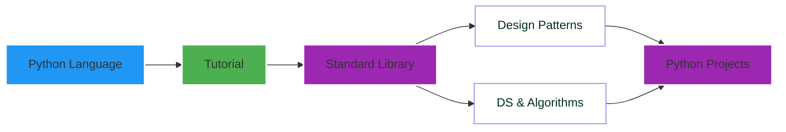

<sup> [Fork me on GitHub](https://github.com/uptimistic/ComputerProgramming) , [Connect via LinkedIn](https://www.linkedin.com/in/kwadwoadutwum/), [Columbia University Email](mailto:ka2526@columbia.edu), [Donate or Buy Coffee](https://ko-fi.com/optimistic)
</sup>

---
---
#  Comprehensive Core Python Cheatsheet
---



<!-- 
side notes : anchor links for TOC and sections

-->

---
<p align="center">
  
</p>

----------
# Contents
----------
**&nbsp;&nbsp;&nbsp;** Table of Contents : **&nbsp;** **[`0 : Introduction`](#Introduction)**__,__ 	**[`1 : Built-in Functions`](#Built-inFunctions)**__,__ 	**[`2 : Built-in Constants`](#Built-inConstants)**__,__ 	**[`3 : Built-in Types`](#Built-inTypes)**__,__ 	**[`4 : Built-in Exceptions`](#Built-inExceptions)**__,__ 	**[`5 : Text Processing Services`](#TextProcessingServices)**__,__ 	**[`6 : Binary Data Services`](#BinaryDataServices)**__,__ 	**[`7 : Data Types`](#DataTypes)**__,__ 	**[`8 : Numeric and Mathematical Modules`](#NumericandMathematicalModules)**__,__ 	**[`9 : Functional Programming Modules`](#FunctionalProgrammingModules)**__,__ 	**[`10 : File and Directory Access`](#FileandDirectoryAccess)**__,__ 	**[`11 : Data Persistence`](#DataPersistence)**__,__ 	**[`12 : Data Compression and Archiving`](#DataCompressionandArchiving)**__,__ 	**[`13 : File Formats`](#FileFormats)**__,__ 	**[`14 : Cryptographic Services`](#CryptographicServices)**__,__ 	**[`15 : Generic Operating System Services`](#GenericOperatingSystemServices)**__,__ 	**[`16 : Concurrent Execution`](#ConcurrentExecution)**__,__ 	**[`17 : Networking and Interprocess Communication`](#NetworkingandInterprocessCommunication)**__,__ 	**[`18 : Internet Data Handling`](#InternetDataHandling)**__,__ 	**[`19 : Structured Markup Processing Tools`](#StructuredMarkupProcessingTools)**__,__ 	**[`20 : Internet Protocols and Support`](#InternetProtocolsandSupport)**__,__ 	**[`21 : Multimedia Services`](#MultimediaServices)**__,__ 	**[`22 : Internationalization`](#Internationalization)**__,__ 	**[`23 : Program Frameworks`](#ProgramFrameworks)**__,__ 	**[`24 : Graphical User Interfaces with Tk`](#GraphicalUserInterfaceswithTk)**__,__ 	**[`25 : Development Tools`](#DevelopmentTools)**__,__ 	**[`26 : Debugging and Profiling`](#DebuggingandProfiling)**__,__ 	**[`27 : Software Packaging and Distribution`](#SoftwarePackagingandDistribution)**__,__ 	**[`28 : Python Runtime Services`](#PythonRuntimeServices)**__,__ 	**[`29 : Custom Python Interpreters`](#CustomPythonInterpreters)**__,__ 	**[`30 : Importing Modules`](#ImportingModules)**__,__ 	**[`31 : Python Language Services`](#PythonLanguageServices)**__,__ 	**[`32 : MS Windows Specific Services`](#MSWindowsSpecificServices)**__,__ 	**[`33 : Unix Specific Services`](#UnixSpecificServices)**__,__ 	**[`34 : Superseded Modules`](#SupersededModules)**__,__ 	**[`35 : Security Considerations`](#SecurityConsiderations)**__.__ 

----------------
# 0 : Introduction
----------------
This is a comprehesive cheatsheet based on the official [Python Standard Library](https://docs.python.org/3/library/index.html).
The aim is to offer users practical example implementation of the core Python language


----------------
# 1. Built-in Functions:
----------------
Python built-in functions and exceptions are programming 
objects that can be used by all Python code without the 
need of the use of an import statement to invoke librarie(s)
 and module(s).

---
**&nbsp;&nbsp;&nbsp;** **1. Built-in Functions:** **&nbsp;** 	**[`A :`](#A)**__,__ **[`abs()`](#abs())**__,__ **[`aiter()`](#aiter())**__,__ 	**[`all()`](#all())**__,__ **[`any()`](#any())**__,__  **[`anext()`](#anext())**__,__ 	**[`ascii()`](#ascii())**__,__ 	**[`B`](#B)**__,__ **[`bin()`](#bin())**__,__ 	**[`bool()`](#bool())**__,__ 	**[`breakpoint()`](#breakpoint())**__,__ 	**[`bytearray()`](#bytearray())**__,__ 	**[`bytes()`](#bytes())**__,__ 	**[`C`](#C)**__,__ 	**[`callable()`](#callable())**__,__ **[`chr()`](#chr())**__,__ 	**[`classmethod()`](#classmethod())**__,__ 	**[`compile()`](#compile())**__,__ 	**[`complex()`](#complex())**__,__ **[`D`](#D)**__,__ 	**[`delattr()`](#delattr())**__,__ 	**[`dict()`](#dict())**__,__ 	**[`dir()`](#dir())**__,__ 	**[`divmod()`](#divmod())**__,__ 	**[`E`](#E)**__,__ 	**[`enumerate()`](#enumerate())**__,__ 	**[`eval()`](#eval())**__,__ 	**[`exec()`](#exec())**__,__ 	**[`F`](#F)**__,__ 	**[`filter()`](#filter())**__,__ 	**[`float()`](#float())**__,__ 	**[`format()`](#format())**__,__ 	**[`frozenset()`](#frozenset())**__,__ 	**[`G`](#G)**__,__ 	**[`getattr()`](#getattr())**__,__ 	**[`globals()`](#globals())**__,__ 	**[`H`](#H)**__,__ 	**[`hasattr()`](#hasattr())**__,__ 	**[`hash()`](#hash())**__,__ 	**[`help()`](#help())**__,__ 	**[`hex()`](#hex())**__,__ 	**[`I`](#I)**__,__ 	**[`id()`](#id())**__,__ 	**[`input()`](#input())**__,__ 	**[`int()`](#int())**__,__ 	**[`isinstance()`](#isinstance())**__,__ 	**[`issubclass()`](#issubclass())**__,__ 	**[`iter()`](#iter())**__,__ 	**[`L`](#L)**__,__ 	**[`len()`](#len())**__,__ 	**[`list()`](#list())**__,__ 	**[`locals()`](#locals())**__,__ 	**[`M`](#M)**__,__ 	**[`map()`](#map())**__,__ 	**[`max()`](#max())**__,__ 	**[`memoryview()`](#memoryview())**__,__ 	**[`min()`](#min())**__,__ 	**[`N`](#N)**__,__ 	**[`next()`](#next())**__,__ 	**[`O`](#O)**__,__ 	**[`object()`](#object())**__,__ 	**[`oct()`](#oct())**__,__ 	**[`open()`](#open())**__,__ 	**[`ord()`](#ord())**__,__ 	**[`P`](#P)**__,__ 	**[`pow()`](#pow())**__,__ 	**[`print()`](#print())**__,__ 	**[`property()`](#property())**__,__ 	**[`R`](#R)**__,__ 	**[`range()`](#range())**__,__ 	**[`repr()`](#repr())**__,__ 	**[`reversed()`](#reversed())**__,__ 	**[`round()`](#round())**__,__ 	**[`S`](#S)**__,__ 	**[`set()`](#set())**__,__ 	**[`setattr()`](#setattr())**__,__ 	**[`slice()`](#slice())**__,__ 	**[`sorted()`](#sorted())**__,__ 	**[`staticmethod()`](#staticmethod())**__,__ 	**[`str()`](#str())**__,__ 	**[`sum()`](#sum())**__,__ 	**[`super()`](#super())**__,__ 	**[`T`](#T)**__,__ 	**[`tuple()`](#tuple())**__,__ 	**[`type()`](#type())**__,__ 	**[`V`](#V)**__,__ 	**[`vars()`](#vars())**__,__ 	**[`Z`](#Z)**__,__ 	**[`zip()`](#zip())**__,__ 	**[`__import__()`](#__import__())**__.__ 

 Built-in Functions List 
-----------------------

| A                   | D                 | I                  | O                | S                    |
|---------------------|-------------------|--------------------|------------------|----------------------|
| ```abs()```         | ```delattr()```   | ```id()```         | ```object()```   | ```set()```          |
| ```aiter()```       | ```dict()```      | ```input()```      | ```oct()```      | ```setattr()```      |
| ```all()```         | ```dir()```       | ```int()```        | ```open()```     | ```slice()```        |
| ```any()```         | ```divmod()```    | ```isinstance()``` | ```ord()```      | ```sorted()```       |
| ```anext()```       | E                 | ```issubclass()``` | P                | ```staticmethod()``` |
| ```ascii()```       | ```enumerate()``` | ```iter()```       | ```pow()```      | ```str()```          |
| B                   | ```eval()```      | L                  | ```print()```    | ```sum()```          |
| ```bin()```         | ```exec()```      | ```len()```        | ```property()``` | ```super()```        |
| ```bool()```        | F                 | ```list()```       | R                | T                    |
| ```breakpoint()```  | ```filter()```    | ```locals()```     | ```range()```    | ```tuple()```        |
| ```bytearray()```   | ```float()```     | M                  | ```repr()```     | ```type()```         |
| ```bytes()```       | ```format()```    | ```map()```        | ```reversed()``` | ---                  |
| C                   | ```frozenset()``` | ```max()```        | ```round()```    | ```__import__()```   |
| ```callable()```    | G                 | ```memoryview()``` | V                |                      |
| ```chr()```         | ```getattr()```   | ```min()```        | ```vars()```     |                      |
| ```classmethod()``` | ```globals()```   | N                  | Z                |                      |
| ```compile()```     |                   | ```next()```       | ```zip()```      |                      |
| ```complex()```     |


___
abs() fucntion 
---
The ```abs()``` function in Python returns the absolute value of a given number. The absolute value of a number is the distance of the number from zero, regardless of whether the number is positive or negative. The syntax for using the abs() function is as follows:

python
Copy code
abs(x)
where x is the number for which you want to find the absolute value.

Here are some examples of using the abs() function:

```python
print(abs(5))      # Output: 5
print(abs(-5))     # Output: 5
print(abs(0))      # Output: 0
print(abs(3.14))   # Output: 3.14
print(abs(-3.14))  # Output: 3.14
```

As you can see from the examples, the abs() function works with both integers and floating-point numbers.

If you try to pass a non-numeric value to the abs() function, you will get a TypeError:

```python

print(abs('hello'))  
# Output: TypeError: bad operand type for abs(): 'str'

```


```python
c = 5 + 3j
print(abs(c))

# Output: 5.830951894845301

```
In this example, we have assigned a complex number 5 + 3j to the variable c. When we call the ```abs()``` function with the parameter c, the function returns the magnitude of the complex number, which is calculated as the square root of the sum of the squares of the real and imaginary parts. Therefore, the output is 5.830951894845301.


In summary, the ```abs()``` function is a built-in Python function that returns the absolute value of a number. It is a useful function for finding the distance of a number from zero, regardless of whether the number is positive or negative.

---
Below are representative use case examples of the abs() funtion :
---

<table border="2">	
  <tr>
    <th>#</th>
    <th>Use Case</th>
    <th>Python Code Example</th>
  </tr>
  <tr>
    <td>1</td>
    <td>Find the absolute value of a given number</td>
    <td>

```python  

num = -10
abs_num = abs(num)
print(abs_num) # Output: 10

```
</td>
  </tr>
  <tr>
    <td>2</td>
    <td>Calculate the distance between two numbers on a number line</td>
       <td>

```python  

num1 = 10
num2 = 20
distance = abs(num1 - num2)
print(distance) # Output: 10

```
</td>
  </tr>
  <tr>
    <td>3</td>
    <td>Determine the magnitude or amplitude of a vector in physics</td>
       <td>

```python  

import cmath
vector = 3 + 4j
magnitude = abs(vector)
print(magnitude) # Output: 5.0

```
</td>
  </tr>
  <tr>
    <td>4</td>
    <td>Determine the magnitude or amplitude of a vector in physics</td>
       <td>


```python  

a = 20
b = -30
difference = abs(a - b)
print(difference) # Output: 50

```
</td>
  </tr>
  <tr>
    <td>5</td>
    <td>Normalize data by converting negative values to positive values</td>
       <td>

```python  

data = [1, -2, 3, -4, 5]
normalized_data = [abs(x) for x in data]
print(normalized_data) # Output: [1, 2, 3, 4, 5]

```
</td>
  </tr>
  <tr>
    <td>6</td>
    <td>Calculate the modulus or remainder of a number without considering its sign</td>
       <td>

```python  

num = -10
divisor = 3
modulus = abs(num) % divisor
print(modulus) # Output: 1

```
</td>
  </tr>
  <tr>
    <td>7</td>
    <td>Convert a complex number to its magnitude or modulus</td>
       <td>

```python  

complex_num = 2 + 3j
magnitude = abs(complex_num)
print(magnitude) # Output: 3.605551275463989

```
</td>
  </tr>
  <tr>
    <td>8</td>
    <td>Determine the error or deviation of a measurement from its true value</td>
       <td>

```python  

measurement = 10
true_value = 15
error = abs(measurement - true_value)
print(error) # Output: 5

```
</td>
  </tr>
  <tr>
    <td>9</td>
    <td>Calculate the absolute difference between two sets of data</td>
       <td>

```python  

set1 = {1, 2, 3}
set2 = {3, 4, 5}
difference = abs(len(set1) - len(set2))
print(difference) # Output: 2

```
</td>
  </tr>
  <tr>
    <td>10</td>
    <td>Evaluate mathematical expressions involving absolute values, such as inequalities or distance formulas</td>
       <td>

```python  

a = 10
b = 20
if abs(a - b) >= 5:
    print("The absolute difference between a and b is greater than or equal to 5")
else:
    print("The absolute difference between a and b is less than 5")
 ```   
</td>
  </tr>
</table>

___
aiter() fucntion 
---
The ```aiter()``` function is a built-in Python function that returns an asynchronous iterator object. It is used to create an asynchronous generator that produces values asynchronously.

An asynchronous iterator is an object that implements the ```__aiter__()``` and ```__anext__()``` methods. The ```__aiter__()``` method returns the asynchronous iterator object itself, while the ```__anext__()``` method returns a coroutine that produces the next value in the asynchronous sequence.

Here's an example of how to use the ```aiter() ```function:

```python
async def my_async_generator():
    for i in range(5):
        await asyncio.sleep(1) # wait for 1 second
        yield i

async def main():
    async for i in aiter(my_async_generator()):
        print(i)

await main()
```

In this example, ```my_async_generator()``` is an asynchronous generator that produces values asynchronously using the yield statement. The async for loop iterates over the asynchronous generator by calling the ```__anext__()``` method to get the next value in the sequence.

The ```aiter()``` function is used to create an asynchronous iterator object from the asynchronous generator object returned by ```my_async_generator()```. This allows the async for loop to iterate over the asynchronous sequence produced by the generator.


When you call aiter() on an iterable object, it returns an asynchronous iterator object that can be used with an async for loop to iterate over the values asynchronously. Here's an example:

```python
import asyncio

async def my_coroutine():
    async for item in aiter(my_iterable):
        print(item)

asyncio.run(my_coroutine())
```

In this example, my_iterable is an iterable object, and aiter() returns an asynchronous iterator object that we can use to iterate over the values in my_iterable asynchronously. The async for loop is used to iterate over the values in the asynchronous iterator, and the print() function is used to output each value as it is encountered.

Note that the ```aiter()``` function can also be used with other types of asynchronous iterators, such as asynchronous generators and asynchronous iterables.

Overall, the ```aiter()``` function is a powerful tool for working with asynchronous sequences in Python, allowing you to easily create and iterate over asynchronous iterators and generators.


---
Below are representative use case examples of the aiter() funtion :
---
  
<table border="2">	
  <tr>
    <th>#</th>
    <th>Use Case</th>
    <th>Python Code Example</th>
  </tr>
  <tr>
    <td>1</td>
    <td>Iterating over an asynchronous generator:
</td>
    <td>

```python  

async def async_gen():
    for i in range(5):
        await asyncio.sleep(1)
        yield i

async def my_coroutine():
    async for i in asyncio.aiter(async_gen()):
        print(i)

asyncio.run(my_coroutine())

```
</td>
</tr>
<tr>
    <td>2</td>
    <td>Iterating over an asynchronous iterable object that returns tasks:
</td>
       <td>

```python  

async def my_coroutine():
    tasks = [asyncio.create_task(async_task(i)) for i in range(5)]
    async for task in asyncio.aiter(tasks):
        await task

async def async_task(i):
    await asyncio.sleep(1)
    print(i)

asyncio.run(my_coroutine())


```
</td>
  </tr>
  <tr>
    <td>3</td>
    <td>Implementing a custom asynchronous iterable object:
</td>
       <td>

```python  

class MyAsyncIterable:
    def __init__(self, start, stop):
        self.start = start
        self.stop = stop
    
    async def __aiter__(self):
        self.current = self.start
        return self
    
    async def __anext__(self):
        if self.current < self.stop:
            await asyncio.sleep(1)
            result = self.current
            self.current += 1
            return result
        else:
            raise StopAsyncIteration

async def my_coroutine():
    async for i in asyncio.aiter(MyAsyncIterable(0, 5)):
        print(i)

asyncio.run(my_coroutine())


```
</td>
  </tr>
 
</table>


___
all() fucntion 
---
<table border="2">	
  <tr>
    <th>#</th>
    <th>Use Case</th>
    <th>Python Code Example</th>
  </tr>
  <tr>
    <td>1</td>
    <td>Iterating over an asynchronous generator:
</td>
    <td>

```python  

# Check if all elements in a list are greater than 0
lst = [1, 2, 3, 4, 5]
result = all(x > 0 for x in lst)
print(result)  # True

# Check if all elements in a tuple are even
tup = (2, 4, 6, 8)
result = all(x % 2 == 0 for x in tup)
print(result)  # True

# Check if all elements in a set are strings
s = {'hello', 'world', 'python'}
result = all(isinstance(x, str) for x in s)
print(result)  # True


```
</td>
</tr>
<tr>
    <td>2</td>
    <td>Checking if an iterable is empty: You can use <code>all()</code> to check if an iterable is empty. If the iterable is empty, <code>all()</code> returns <code>True</code>. Otherwise, it returns <code>False</code>. For example:

</td>
       <td>

```python  

# Check if a list is empty
lst = []
result = all(lst)
print(result)  # True

# Check if a tuple is empty
tup = ()
result = all(tup)
print(result)  # True

# Check if a set is empty
s = set()
result = all(s)
print(result)  # True


```
</td>
  </tr>
  <tr>
    <td>3</td>
    <td>Checking if a list of conditions is true: You can use <code>all</code> to check if a list of conditions is true. For example:

</td>
       <td>

```python  

# Check if a number is positive, even, and a multiple of 4
n = 8
conditions = [n > 0, n % 2 == 0, n % 4 == 0]
result = all(conditions)
print(result)  # True

# Check if a string is all lowercase and contains only letters
s = 'hello'
conditions = [s.islower(), s.isalpha()]
result = all(conditions)
print(result)  # True


```
</td>
  </tr>
 
</table>

<!-- 
prompt : list all uses of the  python any() function and present the results in an html table of three columns labelled as #, Use Case,  Code Example. Use python language identifier to enable syntax highlighting in fenced code block  in the Code Example column

make an html table with all uses cases of the python bool() function with code examples . don't use pre  tag, br tag  and code tag. Wrap code examples in "```python" before the code block and "```" after the code block for optimized GitHub README.md file. present the entire results in a copyable  text . write each line of code in the code block on a separate line and do not use br tag

make an html table with all uses cases of the python bool() function with code examples . don't use pre  tag, br tag  and code tag.  Add output results to the code block example commented with a #. Wrap code examples in "```python" before the code block and "```" after the code block for optimized GitHub README.md file. present the entire results in a copyable  text . write each line of code in the code block on a separate line and do not use br tag. 

-->


___
any() fucntion 
---

<table>
<thead>
<tr>
<th>#</th>
<th>Use Case</th>
<th>Code Example</th>
</tr>
</thead>
<tbody>
<tr>
<td>1</td>
<td>Check if any element in a list is True</td>
<td>


```python
my_list = [False, False, True, False]
result = any(my_list)
print(result) # Output: True

```
</td>

</tr>
<tr>
<td>2</td>
<td>Check if any character in a string is a digit</td>
<td>


```python
my_string = "Hello, world! 123"
result = any(char.isdigit() for char in my_string)
print(result) # Output: True
```
</td>

</tr>
<tr>
<td>3</td>
<td>Check if any element in a tuple satisfies a condition</td>
<td>


```python
my_tuple = (1, 2, 3, 4, 5)
result = any(x > 3 for x in my_tuple)
print(result) # Output: True
```
</td>

</tr>
<tr>
<td>4</td>
<td>Check if any key in a dictionary is True</td>
<td>


```python
my_dict = {'a': False, 'b': False, 'c': True}
result = any(my_dict.values())
print(result) # Output: True
```
</td>

</tr>
<tr>
<td>5</td>
<td>Check if any file in a directory has a specific extension</td>
<td>


```python
import os
dir_path = "/path/to/directory"
extension = ".txt"
result = any(file.endswith(extension) for file in os.listdir(dir_path))
print(result)
```
</td>

</tr>
<tr>
<td>6</td>
<td>Check if any element in a set is True</td>
<td>


```python

my_set = {False, False, True}
result = any(my_set)
print(result) # Output: True
```
</td>

</tr>
<tr>
<td>7</td>
<td>Check if any element in a range satisfies a condition</td>
<td>


```python
my_range = range(1, 10)
result = any(x > 5 for x in my_range)
print(result) # Output: True
```
</td>

</tr>
<tr>
<td>8</td>
<td>Check if any element in a list satisfies a condition</td>
<td>


```python
any(x > 5 for x in [1, 3, 6, 8])
```
</td>

</tr>
<tr>
<td>9</td>
<td>Check if any element in a tuple satisfies a condition</td>
<td>


```python
any(x.startswith("a") for x in ("apple", "banana", "orange"))
```
</td>

</tr>
<tr>
<td>10</td>
<td>Check if any element in a set satisfies a condition</td>
<td>


```python
any(len(x) == 3 for x in {"cat", "dog", "elephant"})
```
</td>

</tr>
<tr>
<td>11</td>
<td>Check if any element in a dictionary satisfies a condition</td>
<td>


```python
any(value > 10 for key, value in {"apple": 5, "banana": 12, "orange": 8}.items())
```
</td>

</tr>
</table>


---
anext() function
---

<table>
  <thead>
  <tr>
    <th>#</th>
    <th>Use Case</th>
    <th>Python Code Example</th>
  </tr>
  </thead>
  <tbody>
    <tr>
      <td>1</td>
      <td>Iterate through an asynchronous iterator until the next item is available</td>
      <td>

  ```python

    import asyncio
    async def my_coroutine():
        my_list = ['apple', 'banana', 'cherry']
        my_iterator = iter(my_list)
        while True:
            try:
                item = await anext(my_iterator)
                print(item)
            except StopAsyncIteration:
                break
    
    asyncio.run(my_coroutine())
    '''
    Output Result :
    apple
    banana
    cherry
    '''
  ```

  </td>
  

</tr>
<tr>
  <td>2</td>
  <td>Get the next item from an asynchronous iterator if available, otherwise return a default value</td>
  <td>

  ```python
    import asyncio
    
    async def my_coroutine():
        my_list = ['apple', 'banana', 'cherry']
        my_iterator = iter(my_list)
        while True:
            item = await anext(my_iterator, default=None)
            if item is None:
                break
            else:
                print(item)
    
    asyncio.run(my_coroutine())
    '''
    Output Result :
    apple
    banana
    cherry
    '''
  ```
  </td>

</tr>
<tr>
  <td>3</td>

  <td>Get the next item from an asynchronous iterator within a timeout period</td>
  <td>

```python
    import asyncio
    
    async def my_coroutine():
        my_list = ['apple', 'banana', 'cherry']
        my_iterator = iter(my_list)
        while True:
            try:
                item = await asyncio.wait_for(anext(my_iterator), timeout=1.0)
                print(item)
            except StopAsyncIteration:
                break
            except asyncio.TimeoutError:
                print("Timed out")
    
    asyncio.run(my_coroutine())
    '''
    Output Result :
    apple
    banana
    cherry
    '''
  ```

  </td>
  

</tr>
<tr>
    <td>4</td>
    <td>Iterating through an asynchronous iterator</td>
 <td>

```python

        async def async_gen():
            yield 1
            yield 2
            yield 3

        async def main():
            async for item in async_gen():
                print(item)

        loop = asyncio.get_event_loop()
        loop.run_until_complete(main())

      '''
      # Output:
        # 1
        # 2
        # 3
      '''
  ```

  </td>
  

</tr>
<tr>
    <td>5</td>
    <td>Getting the next value from an asynchronous iterator</td>
 <td>

```python
        async def async_gen():
            yield 1
            yield 2
            yield 3

        async def main():
            ag = async_gen()
            print(await anext(ag))  # 1
            print(await anext(ag))  # 2
            print(await anext(ag))  # 3

        loop = asyncio.get_event_loop()
        loop.run_until_complete(main())
      '''
      # Output:
        # 1
        # 2
        # 3
      '''
  ```

  </td>
  

</tr>
<tr>
    <td>6</td>
    <td>
Handling StopAsyncIteration when there are no more items
</td>
    <td>

```python
        async def async_gen():
            yield 1
            yield 2
            yield 3

        async def main():
            ag = async_gen()
            print(await anext(ag))  # 1
            print(await anext(ag))  # 2
            print(await anext(ag))  # 3
            try:
                print(await anext(ag))
            except StopAsyncIteration:
                print("No more items")

        loop = asyncio.get_event_loop()
        loop.run_until_complete(main())
       
      '''
      # Output:
        # 1
        # 2
        # 3
      '''
  ```

  </td>
  

</tr>
</table> 


___
ascii() fucntion 
---


<table>
  <thead>
    <tr>
      <th>#</th>
      <th>Use Case</th>
      <th>Python Code Example</th>
    </tr>
  </thead>
  <tbody>
    <tr>
      <td>1</td>
      <td>Check if a string contains any non-ASCII characters</td>
      <td>
 
```python    
my_string = "Hello, world! 😊"
result = all(ord(char) < 128 for char in my_string)
print(result) # Output: False
```
</td>
    </tr>
    <tr>
      <td>2</td>
      <td>Check if a string contains only ASCII characters</td>
      <td>
 
```python     
my_string = "Hello, world!"
result = all(ord(char) < 128 for char in my_string)
print(result) # Output: True
```
</td>
    </tr>
    <tr>
      <td>3</td>
      <td>Convert a byte string containing non-ASCII characters to ASCII</td>
      <td>
 
```python    
my_bytes = b"Hello, world! \xe2\x98\x83"
result = my_bytes.decode('ascii', 'ignore')
print(result) # Output: b"Hello, world! "
```
</td>
    </tr>
    <tr>
      <td>4</td>
      <td>Convert a bytes object to its ASCII representation</td>
      <td>
 
```python    
my_bytes = b"Hello, world! \xe2\x98\x83"
result = ascii(my_bytes)
print(result) # Output: b'Hello, world! \\xe2\\x98\\x83'
```
</td>
    </tr>
    <tr>
      <td>5</td>
      <td>Convert a dictionary containing non-ASCII keys to ASCII</td>
      <td>
 
```python    
my_dict = {'møøse': 'funny', 'spam': 'eggs'}
result = ascii(my_dict)
print(result) # Output: "{'m\\xf8\\xf8se': 'funny', 'spam': 'eggs'}"
```
</td>
    </tr>
    <tr>
      <td>6</td>
      <td>Convert a set containing non-ASCII characters to ASCII</td>
      <td>
 
```python    
my_set = {'møøse', 'spam'}
result = ascii(my_set)
print(result) # Output: "{'m\\xf8\\xf8se', 'spam'}"
```
</td>
    </tr>
    <tr>
      <td>7</td>
      <td>Convert a string containing non-ASCII characters to ASCII</td>
      <td>
 
```python    
my_string = "Hello, world! 😊"
result = ascii(my_string)
print(result) # Output: "'Hello, world! \\U0001f60a'"
```
</td>
    </tr>
    <tr>
      <td>8</td>
      <td>Convert a string to its ASCII representation</td>
      <td>
 
```python    
my_string = "Hello, world!"
result = ascii(my_string)
print(result) # Output: "'Hello, world!'"
```
</td>
    </tr>
    <tr>
      <td>9</td>
      <td>Check if a string contains any non-ASCII characters</td>
      <td>
 
```python    
my_string = "Hello, world! ±"
result = any(ord(char) > 127 for char in my_string)
print(result) # Output: True
```
</td>
    </tr>
    <tr>
      <td>10</td>
      <td>Check if a string contains only ASCII characters</td>
      <td>
 
```python    
my_string = "Hello, world!"
result = all(ord(char) < 128 for char in my_string)
print(result) # Output: True
```
</td>
    </tr>
    <tr>
      <td>11</td>
      <td>Convert a byte string containing non-ASCII characters to ASCII</td>
      <td>
 
```python    
my_bytes = b'Hello, world! ±'
result = my_bytes.decode('ascii', 'ignore')
print(result) # Output: b'Hello, world! '
```
</td>
    </tr>
    <tr>
      <td>12</td>
      <td>Convert a bytes object to its ASCII representation</td>
      <td>
 
```python    
my_bytes = b'Hello, world!'
result = ascii(my_bytes)
print(result) # Output: b'Hello, world!'
```
</td>
    </tr>
    <tr>
      <td>13</td>
      <td>Convert a dictionary containing non-ASCII keys to ASCII</td>
      <td>
 
```python    
my_dict = {'Héllo': 'world'}
      
   result = {ascii(key): value for key, value in my_dict.items()}
print(result) # Output: {'H\\xe9llo': 'world'}
```
</td>
    </tr>
    <tr>
      <td>14</td>
      <td>Convert a set containing non-ASCII characters to ASCII</td>
      <td>
 
```python    
my_set = {'Héllo', 'wörld'}
result = set(ascii(char) for char in my_set)
print(result) # Output: {'H\\xe9llo', 'w\\xf6rld'}
```
</td>
    </tr>
    <tr>
      <td>15</td>
      <td>Convert a string containing non-ASCII characters to ASCII</td>
      <td>
 
```python    
my_string = "Héllo, wörld!"
result = ascii(my_string)
print(result) # Output: 'H\\xe9llo, w\\xf6rld!'
```
</td>
    </tr>
  </body>
  <table>    
    
---
bin() function
---
<table>
  <thead>
    <tr>
      <th>#</th>
      <th>Use Case</th>
      <th>Python Code Example</th>
    </tr>
  </thead>
  <tbody>
    <tr>
      <td>1</td>
      <td>Convert an integer to a binary string</td>
      <td>
      
```python
num = 10
binary_string = bin(num)
print(binary_string)
```
</td>
    </tr>
    <tr>
      <td>2</td>
      <td>Convert an integer to a binary string with a prefix</td>
      <td>
      
```python
num = 10
binary_string = '0b' + bin(num)[2:]
print(binary_string)
```
</td>
    </tr>
    <tr>
      <td>3</td>
      <td>Convert a byte to a binary string</td>
      <td>
      
```python
b = b'\x0f'
binary_string = bin(int.from_bytes(b, byteorder='big'))
print(binary_string)
```
</td>
    </tr>
    <tr>
      <td>4</td>
      <td>Convert a bytearray to a binary string</td>
      <td>
      
```python
b = bytearray(b'\x0f\x1e\x2d\x3c')
binary_string = ''.join(bin(i)[2:].zfill(8) for i in b)
print(binary_string)
```
</td>
    </tr>
    <tr>
      <td>5</td>
      <td>Convert a list of integers to a binary string</td>
      <td>
      
```python

nums = [1, 2, 3, 4]
binary_string = ''.join(bin(i)[2:].zfill(8) for i in nums)
print(binary_string)
```
</td>
    </tr>
    <tr>
      <td>6</td>
      <td>Convert a tuple of integers to a binary string</td>
      <td>
      
```python
nums = (1, 2, 3, 4)
binary_string = ''.join(bin(i)[2:].zfill(8) for i in nums)
print(binary_string)
```
</td>
    </tr>
    <tr>
      <td>7</td>
      <td>Convert a set of integers to a binary string</td>
      <td>
      
```python
nums = {1, 2, 3, 4}
binary_string = ''.join(bin(i)[2:].zfill(8) for i in nums)
print(binary_string)
```
</td>
    </tr>
    <tr>
      <td>8</td>
      <td>Convert a binary string to an integer</td>
      <td>
      
```python
binary_string = '0b1010'
num = int(binary_string, 2)
print(num)
```
</td>
    </tr>
 
  </tbody>
</table>

---
bool() function
---

 <table>
  <thead>
    <tr>
      <th>#</th>
      <th>Use Case</th>
      <th>Python Code Example</th>
    </tr>
  </thead>
  <tbody>   
    <tr>
      <td>1</td>
      <td>Convert a value to a boolean</td>
      <td>
      
```python

value = "hello"
result = bool(value)
print(result) # Output: True
```
</td>
    </tr> 
    <tr>
      <td>2</td>
      <td>Check if a value is True</td>
      <td>
      
```python

value = 5
result = bool(value)
print(result) # Output: True
```
</td>
    </tr>
    <tr>
      <td>3</td>
      <td>Check if a value is False</td>
      <td>
      
```python

value = ""
result = bool(value)
print(result) # Output: False
```
</td>
    </tr>
    <tr>
      <td>4</td>
      <td>Convert an integer to a boolean</td>
      <td>
      
```python

value = 0
result = bool(value)
print(result) # Output: False
```
</td>
    </tr>
    <tr>
      <td>5</td>
      <td>Convert a float to a boolean</td>
      <td>
      
```python

value = 0.0
result = bool(value)
print(result) # Output: False
```
</td>
    </tr>
    <tr>
      <td>6</td>
      <td>Convert a string to a boolean</td>
      <td>
      
```python

value = "False"
result = bool(value)
print(result) # Output: True
```
</td>
    </tr>
    <tr>
      <td>7</td>
      <td>Check if a list is empty</td>
      <td>
      
```python

my_list = []
result = bool(my_list)
print(result) # Output: False
```
</td>
    </tr>
    <tr>
      <td>8</td>
      <td>Check if a tuple is empty</td>
      <td>
      
```python

my_tuple = ()
result = bool(my_tuple)
print(result) # Output: False
```
</td>
    </tr>
    <tr>
      <td>9</td>
      <td>Check if a dictionary is empty</td>
      <td>
      
```python

my_dict = {}
result = bool(my_dict)
print(result) # Output: False
```
</td>
    </tr>
    <tr>
      <td>10</td>
      <td>Check if a set is empty</td>
      <td>
      
```python

my_set = set()
result = bool(my_set)
print(result) # Output: False
```
</td>
    </tr>
    <tr>
      <td>11</td>
      <td>Convert a boolean to a string</td>
      <td>
      
```python

value = True
result = str(value)
print(result) # Output: 'True'
```

  </td>
  

</tr>
</tbody> 

</table> 


**&nbsp;&nbsp;&nbsp;** **2. Built-in Constants:** **&nbsp;** 

**&nbsp;&nbsp;&nbsp;** **3. Built-in Types:** **&nbsp;** 	**[`Truth Value Testing`](#TruthValueTesting)**__,__ 	**[`Boolean Operations — and, or, not`](#BooleanOperations—and,or,not)**__,__ 	**[`Comparisons`](#Comparisons)**__,__ 	**[`Numeric Types — int, float, complex`](#NumericTypes—int,float,complex)**__,__ 	**[`Iterator Types`](#IteratorTypes)**__,__ 	**[`Sequence Types — list, tuple, range`](#SequenceTypes—list,tuple,range)**__,__ 	**[`Text Sequence Type — str`](#TextSequenceType—str)**__,__ 	**[`Binary Sequence Types — bytes, bytearray, memoryview`](#BinarySequenceTypes—bytes,bytearray,memoryview)**__,__ 	**[`Set Types — set, frozenset`](#SetTypes—set,frozenset)**__,__ 	**[`Mapping Types — dict`](#MappingTypes—dict)**__,__ 	**[`Context Manager Types`](#ContextManagerTypes)**__,__ **[`Type Annotation Types — Generic Alias, Union`](#TypeAnnotationTypes—GenericAlias,Union)**__,__ 	**[`Other Built-in Types`](#OtherBuilt-inTypes)**__,__ 	**[`Special Attributes`](#SpecialAttributes)**__,__ 	**[`Integer string conversion length limitation`](#Integerstringconversionlengthlimitation)**__.__ 


**&nbsp;&nbsp;&nbsp;** **4. Built-in Exceptions:** **&nbsp;** 	**[`Exception context`](#Exceptioncontext)**__,__ 	**[`Inheriting from built-in exceptions`](#Inheritingfrombuilt-inexceptions)**__,__ 	**[`Base classes`](#Baseclasses)**__,__ 	**[`Concrete exceptions`](#Concreteexceptions)**__,__ 	**[`Warnings`](#Warnings)**__,__ 	**[`Exception groups`](#Exceptiongroups)**__,__ 	**[`Exception hierarchy`](#Exceptionhierarchy)**__.__ 																					

**&nbsp;&nbsp;&nbsp;** **5. Text Processing Services:** **&nbsp;** 	**[`string — Common string operations`](#string—Commonstringoperations)**__,__ 	**[`re — Regular expression operations`](#re—Regularexpressionoperations)**__,__ 	**[`difflib — Helpers for computing deltas`](#difflib—Helpersforcomputingdeltas)**__,__ 	**[`textwrap — Text wrapping and filling`](#textwrap—Textwrappingandfilling)**__,__ 	**[`unicodedata — Unicode Database`](#unicodedata—UnicodeDatabase)**__,__ 	**[`stringprep — Internet String Preparation`](#stringprep—InternetStringPreparation)**__,__ 	**[`readline — GNU readline interface`](#readline—GNUreadlineinterface)**__,__ 	**[`rlcompleter — Completion function for GNU readline`](#rlcompleter—CompletionfunctionforGNUreadline)**__.__ 		


**&nbsp;&nbsp;&nbsp;** **6. Binary Data Services:** **&nbsp;** 	**[`struct — Interpret bytes as packed binary data`](#struct—Interpretbytesaspackedbinarydata)**__,__ 	**[`codecs — Codec registry and base classes`](#codecs—Codecregistryandbaseclasses)**__.__


**&nbsp;&nbsp;&nbsp;** **7. Data Types:** **&nbsp;** 	**[`datetime — Basic date and time types`](#datetime—Basicdateandtimetypes)**__,__ 	**[`zoneinfo — IANA time zone support`](#zoneinfo—IANAtimezonesupport)**__,__ 	**[`calendar — General calendar-related functions`](#calendar—Generalcalendar-relatedfunctions)**__,__ 	**[`collections — Container datatypes`](#collections—Containerdatatypes)**__,__ 	**[`collections.abc — Abstract Base Classes for Containers`](#collections.abc—AbstractBaseClassesforContainers)**__,__ 	**[`heapq — Heap queue algorithm`](#heapq—Heapqueuealgorithm)**__,__ 	**[`bisect — Array bisection algorithm`](#bisect—Arraybisectionalgorithm)**__,__ 	**[`array — Efficient arrays of numeric values`](#array—Efficientarraysofnumericvalues)**__,__ 	**[`weakref — Weak references`](#weakref—Weakreferences)**__,__ 	**[`types — Dynamic type creation and names for built-in types`](#types—Dynamictypecreationandnamesforbuilt-intypes)**__,__ 	**[`copy — Shallow and deep copy operations`](#copy—Shallowanddeepcopyoperations)**__,__ 	**[`pprint — Data pretty printer`](#pprint—Dataprettyprinter)**__,__ 	**[`reprlib — Alternate repr() implementation`](#reprlib—Alternaterepr()implementation)**__,__ 	**[`enum — Support for enumerations`](#enum—Supportforenumerations)**__,__ 	**[`graphlib — Functionality to operate with graph-like structures`](#graphlib—Functionalitytooperatewithgraph-likestructures)**__.__ 


**&nbsp;&nbsp;&nbsp;** **8. Numeric and Mathematical Modules:** **&nbsp;** 	**[`numbers — Numeric abstract base classes`](#numbers—Numericabstractbaseclasses)**__,__ 	**[`math — Mathematical functions`](#math—Mathematicalfunctions)**__,__ 	**[`cmath — Mathematical functions for complex numbers`](#cmath—Mathematicalfunctionsforcomplexnumbers)**__,__ 	**[`decimal — Decimal fixed point and floating point arithmetic`](#decimal—Decimalfixedpointandfloatingpointarithmetic)**__,__ 	**[`fractions — Rational numbers`](#fractions—Rationalnumbers)**__,__ 	**[`random — Generate pseudo-random numbers`](#random—Generatepseudo-randomnumbers)**__,__ 	**[`statistics — Mathematical statistics functions`](#statistics—Mathematicalstatisticsfunctions)**__,__ 						


**&nbsp;&nbsp;&nbsp;** **9. Functional Programming Modules:** **&nbsp;** 	**[`itertools — Functions creating iterators for efficient looping`](#itertools—Functionscreatingiteratorsforefficientlooping)**__,__ 	**[`functools — Higher-order functions and operations on callable objects`](#functools—Higher-orderfunctionsandoperationsoncallableobjects)**__,__ 	**[`operator — Standard operators as functions`](#operator—Standardoperatorsasfunctions)**__.__ 	


**&nbsp;&nbsp;&nbsp;** **10. File and Directory Access:** **&nbsp;** 	**[`pathlib — Object-oriented filesystem paths`](#pathlib—Object-orientedfilesystempaths)**__,__ 	**[`os.path — Common pathname manipulations`](#os.path—Commonpathnamemanipulations)**__,__ 	**[`fileinput — Iterate over lines from multiple input streams`](#fileinput—Iterateoverlinesfrommultipleinputstreams)**__,__ 	**[`stat — Interpreting stat() results`](#stat—Interpretingstat()results)**__,__ 	**[`filecmp — File and Directory Comparisons`](#filecmp—FileandDirectoryComparisons)**__,__ 	**[`tempfile — Generate temporary files and directories`](#tempfile—Generatetemporaryfilesanddirectories)**__,__ 	**[`glob — Unix style pathname pattern expansion`](#glob—Unixstylepathnamepatternexpansion)**__,__ 	**[`fnmatch — Unix filename pattern matching`](#fnmatch—Unixfilenamepatternmatching)**__,__ 	**[`linecache — Random access to text lines`](#linecache—Randomaccesstotextlines)**__,__ **[`shutil — High-level file operations`](#shutil—High-levelfileoperations)**__.__ 		


**&nbsp;&nbsp;&nbsp;** **11. Data Persistence:** **&nbsp;** 	**[`pickle — Python object serialization`](#pickle—Pythonobjectserialization)**__,__ 	**[`copyreg — Register pickle support functions`](#copyreg—Registerpicklesupportfunctions)**__,__ 	**[`shelve — Python object persistence`](#shelve—Pythonobjectpersistence)**__,__ 	**[`marshal — Internal Python object serialization`](#marshal—InternalPythonobjectserialization)**__,__ 	**[`dbm — Interfaces to Unix “databases”`](#dbm—InterfacestoUnix“databases”)**__,__ 	**[`sqlite3 — DB-API 2.0 interface for SQLite databases`](#sqlite3—DB-API2.0interfaceforSQLitedatabases)**__.__ 																					


**&nbsp;&nbsp;&nbsp;** **12. Data Compression and Archiving:** **&nbsp;** 	**[`zlib — Compression compatible with gzip`](#zlib—Compressioncompatiblewithgzip)**__,__ 	**[`gzip — Support for gzip files`](#gzip—Supportforgzipfiles)**__,__ 	**[`bz2 — Support for bzip2 compression`](#bz2—Supportforbzip2compression)**__,__ 	**[`lzma — Compression using the LZMA algorithm`](#lzma—CompressionusingtheLZMAalgorithm)**__,__ 	**[`zipfile — Work with ZIP archives`](#zipfile—WorkwithZIParchives)**__,__ 	**[`tarfile — Read and write tar archive files`](#tarfile—Readandwritetararchivefiles)**__.__


**&nbsp;&nbsp;&nbsp;** **13. File Formats:** **&nbsp;** 	**[`csv — CSV File Reading and Writing`](#csv—CSVFileReadingandWriting)**__,__ 	**[`configparser — Configuration file parser`](#configparser—Configurationfileparser)**__,__ 	**[`tomllib — Parse TOML files`](#tomllib—ParseTOMLfiles)**__,__ 	**[`netrc — netrc file processing`](#netrc—netrcfileprocessing)**__,__ 	**[`plistlib — Generate and parse Apple .plist files`](#plistlib—GenerateandparseApple.plistfiles)**__.__ 		


**&nbsp;&nbsp;&nbsp;** **14. Cryptographic Services:** **&nbsp;** 	**[`hashlib — Secure hashes and message digests`](#hashlib—Securehashesandmessagedigests)**__,__ 	**[`hmac — Keyed-Hashing for Message Authentication`](#hmac—Keyed-HashingforMessageAuthentication)**__,__ 	**[`secrets — Generate secure random numbers for managing secrets`](#secrets—Generatesecurerandomnumbersformanagingsecrets)**__.__ 	


**&nbsp;&nbsp;&nbsp;** **15. Generic Operating System Services:** **&nbsp;** 	**[`os — Miscellaneous operating system interfaces`](#os—Miscellaneousoperatingsysteminterfaces)**__,__ 	**[`io — Core tools for working with streams`](#io—Coretoolsforworkingwithstreams)**__,__ 	**[`time — Time access and conversions`](#time—Timeaccessandconversions)**__,__ 	**[`argparse — Parser for command-line options, arguments and sub-commands`](#argparse—Parserforcommand-lineoptions,argumentsandsub-commands)**__,__ 	**[`getopt — C-style parser for command line options`](#getopt—C-styleparserforcommandlineoptions)**__,__ 	**[`logging — Logging facility for Python`](#logging—LoggingfacilityforPython)**__,__ 	**[`logging.config — Logging configuration`](#logging.config—Loggingconfiguration)**__,__ 	**[`logging.handlers — Logging handlers`](#logging.handlers—Logginghandlers)**__,__ 	**[`getpass — Portable password input`](#getpass—Portablepasswordinput)**__,__ 	**[`curses — Terminal handling for character-cell displays`](#curses—Terminalhandlingforcharacter-celldisplays)**__,__ 	**[`curses.textpad — Text input widget for curses programs`](#curses.textpad—Textinputwidgetforcursesprograms)**__,__ 	**[`curses.ascii — Utilities for ASCII characters`](#curses.ascii—UtilitiesforASCIIcharacters)**__,__ 	**[`curses.panel — A panel stack extension for curses`](#curses.panel—Apanelstackextensionforcurses)**__,__ 	**[`platform — Access to underlying platform’s identifying data`](#platform—Accesstounderlyingplatform’sidentifyingdata)**__,__ 	**[`errno — Standard errno system symbols`](#errno—Standarderrnosystemsymbols)**__,__ 	**[`ctypes — A foreign function library for Python`](#ctypes—AforeignfunctionlibraryforPython)**__.__


**&nbsp;&nbsp;&nbsp;** **16. Concurrent Execution:** **&nbsp;** 	**[`threading — Thread-based parallelism`](#threading—Thread-basedparallelism)**__,__ 	**[`multiprocessing — Process-based parallelism`](#multiprocessing—Process-basedparallelism)**__,__ 	**[`multiprocessing.shared_memory — Shared memory for direct access across processes`](#multiprocessing.shared_memory—Sharedmemoryfordirectaccessacrossprocesses)**__,__ 	**[`The concurrent package`](#Theconcurrentpackage)**__,__ 	**[`concurrent.futures — Launching parallel tasks`](#concurrent.futures—Launchingparalleltasks)**__,__ 	**[`subprocess — Subprocess management`](#subprocess—Subprocessmanagement)**__,__ 	**[`sched — Event scheduler`](#sched—Eventscheduler)**__,__ 	**[`queue — A synchronized queue class`](#queue—Asynchronizedqueueclass)**__,__ 	**[`contextvars — Context Variables`](#contextvars—ContextVariables)**__,__ 	**[`_thread — Low-level threading API`](#_thread—Low-levelthreadingAPI)**__.__ 	


**&nbsp;&nbsp;&nbsp;** **17. Networking and Interprocess Communication:** **&nbsp;** 	**[`asyncio — Asynchronous I/O`](#asyncio—AsynchronousI/O)**__,__ 	**[`socket — Low-level networking interface`](#socket—Low-levelnetworkinginterface)**__,__ 	**[`ssl — TLS/SSL wrapper for socket objects`](#ssl—TLS/SSLwrapperforsocketobjects)**__,__ 	**[`select — Waiting for I/O completion`](#select—WaitingforI/Ocompletion)**__,__ 	**[`selectors — High-level I/O multiplexing`](#selectors—High-levelI/Omultiplexing)**__,__ 	**[`signal — Set handlers for asynchronous events`](#signal—Sethandlersforasynchronousevents)**__,__ 	**[`mmap — Memory-mapped file support`](#mmap—Memory-mappedfilesupport)**__.__ 	


**&nbsp;&nbsp;&nbsp;** **18. Internet Data Handling:** **&nbsp;** 	**[`email — An email and MIME handling package`](#email—AnemailandMIMEhandlingpackage)**__,__ 	**[`json — JSON encoder and decoder`](#json—JSONencoderanddecoder)**__,__ 	**[`mailbox — Manipulate mailboxes in various formats`](#mailbox—Manipulatemailboxesinvariousformats)**__,__ 	**[`mimetypes — Map filenames to MIME types`](#mimetypes—MapfilenamestoMIMEtypes)**__,__ 	**[`base64 — Base16, Base32, Base64, Base85 Data Encodings`](#base64—Base16,Base32,Base64,Base85DataEncodings)**__,__ 	**[`binascii — Convert between binary and ASCII`](#binascii—ConvertbetweenbinaryandASCII)**__,__ 	**[`quopri — Encode and decode MIME quoted-printable data`](#quopri—EncodeanddecodeMIMEquoted-printabledata)**__.__ 


**&nbsp;&nbsp;&nbsp;** **19. Structured Markup Processing Tools:** **&nbsp;** 	**[`html — HyperText Markup Language support`](#html—HyperTextMarkupLanguagesupport)**__,__ 	**[`html.parser — Simple HTML and XHTML parser`](#html.parser—SimpleHTMLandXHTMLparser)**__,__ 	**[`html.entities — Definitions of HTML general entities`](#html.entities—DefinitionsofHTMLgeneralentities)**__,__ 	**[`XML Processing Modules`](#XMLProcessingModules)**__,__ 	**[`xml.etree.ElementTree — The ElementTree XML API`](#xml.etree.ElementTree—TheElementTreeXMLAPI)**__,__ 	**[`xml.dom — The Document Object Model API`](#xml.dom—TheDocumentObjectModelAPI)**__,__ 	**[`xml.dom.minidom — Minimal DOM implementation`](#xml.dom.minidom—MinimalDOMimplementation)**__,__ 	**[`xml.dom.pulldom — Support for building partial DOM trees`](#xml.dom.pulldom—SupportforbuildingpartialDOMtrees)**__,__ 	**[`xml.sax — Support for SAX2 parsers`](#xml.sax—SupportforSAX2parsers)**__,__ 	**[`xml.sax.handler — Base classes for SAX handlers`](#xml.sax.handler—BaseclassesforSAXhandlers)**__,__ 	**[`xml.sax.saxutils — SAX Utilities`](#xml.sax.saxutils—SAXUtilities)**__,__ 	**[`xml.sax.xmlreader — Interface for XML parsers`](#xml.sax.xmlreader—InterfaceforXMLparsers)**__,__ 	**[`xml.parsers.expat — Fast XML parsing using Expat`](#xml.parsers.expat—FastXMLparsingusingExpat)**__.__


**&nbsp;&nbsp;&nbsp;** **20. Internet Protocols and Support:** **&nbsp;** 	**[`webbrowser — Convenient web-browser controller`](#webbrowser—Convenientweb-browsercontroller)**__,__ 	**[`wsgiref — WSGI Utilities and Reference Implementation`](#wsgiref—WSGIUtilitiesandReferenceImplementation)**__,__ 	**[`urllib — URL handling modules`](#urllib—URLhandlingmodules)**__,__ 	**[`urllib.request — Extensible library for opening URLs`](#urllib.request—ExtensiblelibraryforopeningURLs)**__,__ 	**[`urllib.response — Response classes used by urllib`](#urllib.response—Responseclassesusedbyurllib)**__,__ 	**[`urllib.parse — Parse URLs into components`](#urllib.parse—ParseURLsintocomponents)**__,__ 	**[`urllib.error — Exception classes raised by urllib.request`](#urllib.error—Exceptionclassesraisedbyurllib.request)**__,__ 	**[`urllib.robotparser — Parser for robots.txt`](#urllib.robotparser—Parserforrobots.txt)**__,__ 	**[`http — HTTP modules`](#http—HTTPmodules)**__,__ 	**[`http.client — HTTP protocol client`](#http.client—HTTPprotocolclient)**__,__ 	**[`ftplib — FTP protocol client`](#ftplib—FTPprotocolclient)**__,__ 	**[`poplib — POP3 protocol client`](#poplib—POP3protocolclient)**__,__ 	**[`imaplib — IMAP4 protocol client`](#imaplib—IMAP4protocolclient)**__,__ 	**[`smtplib — SMTP protocol client`](#smtplib—SMTPprotocolclient)**__,__ 	**[`uuid — UUID objects according to RFC 4122`](#uuid—UUIDobjectsaccordingtoRFC4122)**__,__ 	**[`socketserver — A framework for network servers`](#socketserver—Aframeworkfornetworkservers)**__,__ 	**[`http.server — HTTP servers`](#http.server—HTTPservers)**__,__ 	**[`http.cookies — HTTP state management`](#http.cookies—HTTPstatemanagement)**__,__ 	**[`http.cookiejar — Cookie handling for HTTP clients`](#http.cookiejar—CookiehandlingforHTTPclients)**__,__ 	**[`xmlrpc — XMLRPC server and client modules`](#xmlrpc—XMLRPCserverandclientmodules)**__,__ 	**[`xmlrpc.client — XML-RPC client access`](#xmlrpc.client—XML-RPCclientaccess)**__,__ 	**[`xmlrpc.server — Basic XML-RPC servers`](#xmlrpc.server—BasicXML-RPCservers)**__,__ 	**[`ipaddress — IPv4/IPv6 manipulation library`](#ipaddress—IPv4/IPv6manipulationlibrary)**__.__ 	


**&nbsp;&nbsp;&nbsp;** **21. Multimedia Services:** **&nbsp;** 	**[`wave — Read and write WAV files`](#wave—ReadandwriteWAVfiles)**__,__ 	**[`colorsys — Conversions between color systems`](#colorsys—Conversionsbetweencolorsystems)**__.__
																						


**&nbsp;&nbsp;&nbsp;** **22. Internationalization:** **&nbsp;** 	**[`gettext — Multilingual internationalization services`](#gettext—Multilingualinternationalizationservices)**__,__ 	**[`locale — Internationalization services`](#locale—Internationalizationservices)**__.__ 	


**&nbsp;&nbsp;&nbsp;** **23. Program Frameworks:** **&nbsp;** 	**[`turtle — Turtle graphics`](#turtle—Turtlegraphics)**__,__ 	**[`cmd — Support for line-oriented command interpreters`](#cmd—Supportforline-orientedcommandinterpreters)**__,__ 	**[`shlex — Simple lexical analysis`](#shlex—Simplelexicalanalysis)**__.__ 		


**&nbsp;&nbsp;&nbsp;** **24. Graphical User Interfaces with Tk:** **&nbsp;** 	**[`tkinter — Python interface to Tcl/Tk`](#tkinter—PythoninterfacetoTcl/Tk)**__,__ 	**[`tkinter.colorchooser — Color choosing dialog`](#tkinter.colorchooser—Colorchoosingdialog)**__,__ 	**[`tkinter.font — Tkinter font wrapper`](#tkinter.font—Tkinterfontwrapper)**__,__ 	**[`Tkinter Dialogs`](#TkinterDialogs)**__,__ 	**[`tkinter.messagebox — Tkinter message prompts`](#tkinter.messagebox—Tkintermessageprompts)**__,__ 	**[`tkinter.scrolledtext — Scrolled Text Widget`](#tkinter.scrolledtext—ScrolledTextWidget)**__,__ 	**[`tkinter.dnd — Drag and drop support`](#tkinter.dnd—Draganddropsupport)**__,__ 	**[`tkinter.ttk — Tk themed widgets`](#tkinter.ttk—Tkthemedwidgets)**__,__ 	**[`tkinter.tix — Extension widgets for Tk`](#tkinter.tix—ExtensionwidgetsforTk)**__,__ 	**[`IDLE`](#IDLE)**__.__ 


**&nbsp;&nbsp;&nbsp;** **25. Development Tools:** **&nbsp;** 	**[`typing — Support for type hints`](#typing—Supportfortypehints)**__,__ 	**[`pydoc — Documentation generator and online help system`](#pydoc—Documentationgeneratorandonlinehelpsystem)**__,__ 	**[`Python Development Mode`](#PythonDevelopmentMode)**__,__ 	**[`Effects of the Python Development Mode`](#EffectsofthePythonDevelopmentMode)**__,__ 	**[`ResourceWarning Example`](#ResourceWarningExample)**__,__ 	**[`Bad file descriptor error example`](#Badfiledescriptorerrorexample)**__,__ 	**[`doctest — Test interactive Python examples`](#doctest—TestinteractivePythonexamples)**__,__ 	**[`unittest — Unit testing framework`](#unittest—Unittestingframework)**__,__ 	**[`unittest.mock — mock object library`](#unittest.mock—mockobjectlibrary)**__,__ 	**[`unittest.mock — getting started`](#unittest.mock—gettingstarted)**__,__ 	**[`2to3 — Automated Python 2 to 3 code translation`](#2to3—AutomatedPython2to3codetranslation)**__,__ 	**[`test — Regression tests package for Python`](#test—RegressiontestspackageforPython)**__,__ 	**[`test.support — Utilities for the Python test suite`](#test.support—UtilitiesforthePythontestsuite)**__,__ 	**[`test.support.socket_helper — Utilities for socket tests`](#test.support.socket_helper—Utilitiesforsockettests)**__,__ 	**[`test.support.script_helper — Utilities for the Python execution tests`](#test.support.script_helper—UtilitiesforthePythonexecutiontests)**__,__ 	**[`test.support.bytecode_helper — Support tools for testing correct bytecode generation`](#test.support.bytecode_helper—Supporttoolsfortestingcorrectbytecodegeneration)**__,__ 	**[`test.support.threading_helper — Utilities for threading tests`](#test.support.threading_helper—Utilitiesforthreadingtests)**__,__ 	**[`test.support.os_helper — Utilities for os tests`](#test.support.os_helper—Utilitiesforostests)**__,__ 	**[`test.support.import_helper — Utilities for import tests`](#test.support.import_helper—Utilitiesforimporttests)**__,__ 	**[`test.support.warnings_helper — Utilities for warnings tests`](#test.support.warnings_helper—Utilitiesforwarningstests)**__.__


**&nbsp;&nbsp;&nbsp;** **26. Debugging and Profiling:** **&nbsp;** 	**[`Audit events table`](#Auditeventstable)**__,__ 	**[`bdb — Debugger framework`](#bdb—Debuggerframework)**__,__ 	**[`faulthandler — Dump the Python traceback`](#faulthandler—DumpthePythontraceback)**__,__ 	**[`pdb — The Python Debugger`](#pdb—ThePythonDebugger)**__,__ 	**[`The Python Profilers`](#ThePythonProfilers)**__,__ 	**[`timeit — Measure execution time of small code snippets`](#timeit—Measureexecutiontimeofsmallcodesnippets)**__,__ 	**[`trace — Trace or track Python statement execution`](#trace—TraceortrackPythonstatementexecution)**__,__ 	**[`tracemalloc — Trace memory allocations`](#tracemalloc—Tracememoryallocations)**__.__


**&nbsp;&nbsp;&nbsp;** **27. Software Packaging and Distribution:** **&nbsp;** 	**[`distutils — Building and installing Python modules`](#distutils—BuildingandinstallingPythonmodules)**__,__ 	**[`ensurepip — Bootstrapping the pip installer`](#ensurepip—Bootstrappingthepipinstaller)**__,__ 	**[`venv — Creation of virtual environments`](#venv—Creationofvirtualenvironments)**__,__ 	**[`zipapp — Manage executable Python zip archives`](#zipapp—ManageexecutablePythonziparchives)**__.__


**&nbsp;&nbsp;&nbsp;** **28. Python Runtime Services:** **&nbsp;** 	**[`sys — System-specific parameters and functions`](#sys—System-specificparametersandfunctions)**__,__ 	**[`sysconfig — Provide access to Python’s configuration information`](#sysconfig—ProvideaccesstoPython’sconfigurationinformation)**__,__ 	**[`builtins — Built-in objects`](#builtins—Built-inobjects)**__,__ 	**[`__main__ — Top-level code environment`](#__main__—Top-levelcodeenvironment)**__,__ 	**[`warnings — Warning control`](#warnings—Warningcontrol)**__,__ 	**[`dataclasses — Data Classes`](#dataclasses—DataClasses)**__,__ 	**[`contextlib — Utilities for with-statement contexts`](#contextlib—Utilitiesforwith-statementcontexts)**__,__ 	**[`abc — Abstract Base Classes`](#abc—AbstractBaseClasses)**__,__ 	**[`atexit — Exit handlers`](#atexit—Exithandlers)**__,__ 	**[`traceback — Print or retrieve a stack traceback`](#traceback—Printorretrieveastacktraceback)**__,__ 	**[`__future__ — Future statement definitions`](#__future__—Futurestatementdefinitions)**__,__ 	**[`gc — Garbage Collector interface`](#gc—GarbageCollectorinterface)**__,__ 	**[`inspect — Inspect live objects`](#inspect—Inspectliveobjects)**__,__ 	**[`site — Site-specific configuration hook`](#site—Site-specificconfigurationhook)**__.__ 	


**&nbsp;&nbsp;&nbsp;** **29. Custom Python Interpreters:** **&nbsp;** 	**[`code — Interpreter base classes`](#code—Interpreterbaseclasses)**__,__ 	**[`codeop — Compile Python code`](#codeop—CompilePythoncode)**__.__ 											


**&nbsp;&nbsp;&nbsp;** **30. Importing Modules:** **&nbsp;** 	**[`zipimport — Import modules from Zip archives`](#zipimport—ImportmodulesfromZiparchives)**__,__ 	**[`pkgutil — Package extension utility`](#pkgutil—Packageextensionutility)**__,__ 	**[`modulefinder — Find modules used by a script`](#modulefinder—Findmodulesusedbyascript)**__,__ 	**[`runpy — Locating and executing Python modules`](#runpy—LocatingandexecutingPythonmodules)**__,__ 	**[`importlib — The implementation of import`](#importlib—Theimplementationofimport)**__,__ 	**[`importlib.resources – Resources`](#importlib.resources–Resources)**__,__ 	**[`Deprecated functions`](#Deprecatedfunctions)**__,__ 	**[`importlib.resources.abc – Abstract base classes for resources`](#importlib.resources.abc–Abstractbaseclassesforresources)**__,__ 	**[`Using importlib.metadata`](#Usingimportlib.metadata)**__,__ 	**[`The initialization of the sys.path module search path`](#Theinitializationofthesys.pathmodulesearchpath)**__.__


**&nbsp;&nbsp;&nbsp;** **31. Python Language Services:** **&nbsp;** 	**[`ast — Abstract Syntax Trees`](#ast—AbstractSyntaxTrees)**__,__ 	**[`symtable — Access to the compiler’s symbol tables`](#symtable—Accesstothecompiler’ssymboltables)**__,__ 	**[`token — Constants used with Python parse trees`](#token—ConstantsusedwithPythonparsetrees)**__,__ 	**[`keyword — Testing for Python keywords`](#keyword—TestingforPythonkeywords)**__,__ 	**[`tokenize — Tokenizer for Python source`](#tokenize—TokenizerforPythonsource)**__,__ 	**[`tabnanny — Detection of ambiguous indentation`](#tabnanny—Detectionofambiguousindentation)**__,__ 	**[`pyclbr — Python module browser support`](#pyclbr—Pythonmodulebrowsersupport)**__,__ 	**[`py_compile — Compile Python source files`](#py_compile—CompilePythonsourcefiles)**__,__ 	**[`compileall — Byte-compile Python libraries`](#compileall—Byte-compilePythonlibraries)**__,__ 	**[`dis — Disassembler for Python bytecode`](#dis—DisassemblerforPythonbytecode)**__,__ 	**[`pickletools — Tools for pickle developers`](#pickletools—Toolsforpickledevelopers)**__.__ 	


**&nbsp;&nbsp;&nbsp;** **32. MS Windows Specific Services:** **&nbsp;** 	**[`msvcrt — Useful routines from the MS VC++ runtime`](#msvcrt—UsefulroutinesfromtheMSVC++runtime)**__,__ 	**[`winreg — Windows registry access`](#winreg—Windowsregistryaccess)**__,__ 	**[`winsound — Sound-playing interface for Windows`](#winsound—Sound-playinginterfaceforWindows)**__.__


**&nbsp;&nbsp;&nbsp;** **33. Unix Specific Services:** **&nbsp;** 	**[`posix — The most common POSIX system calls`](#posix—ThemostcommonPOSIXsystemcalls)**__,__ 	**[`pwd — The password database`](#pwd—Thepassworddatabase)**__,__ 	**[`grp — The group database`](#grp—Thegroupdatabase)**__,__ 	**[`termios — POSIX style tty control`](#termios—POSIXstylettycontrol)**__,__ 	**[`tty — Terminal control functions`](#tty—Terminalcontrolfunctions)**__,__ 	**[`pty — Pseudo-terminal utilities`](#pty—Pseudo-terminalutilities)**__,__ 	**[`fcntl — The fcntl and ioctl system calls`](#fcntl—Thefcntlandioctlsystemcalls)**__,__ 	**[`resource — Resource usage information`](#resource—Resourceusageinformation)**__,__ 	**[`syslog — Unix syslog library routines`](#syslog—Unixsysloglibraryroutines)**__.__


**&nbsp;&nbsp;&nbsp;** **34. Superseded Modules:** **&nbsp;** 	**[`aifc — Read and write AIFF and AIFC files`](#aifc—ReadandwriteAIFFandAIFCfiles)**__,__ 	**[`asynchat — Asynchronous socket command/response handler`](#asynchat—Asynchronoussocketcommand/responsehandler)**__,__ 	**[`asyncore — Asynchronous socket handler`](#asyncore—Asynchronoussockethandler)**__,__ 	**[`audioop — Manipulate raw audio data`](#audioop—Manipulaterawaudiodata)**__,__ 	**[`cgi — Common Gateway Interface support`](#cgi—CommonGatewayInterfacesupport)**__,__ 	**[`cgitb — Traceback manager for CGI scripts`](#cgitb—TracebackmanagerforCGIscripts)**__,__ 	**[`chunk — Read IFF chunked data`](#chunk—ReadIFFchunkeddata)**__,__ 	**[`crypt — Function to check Unix passwords`](#crypt—FunctiontocheckUnixpasswords)**__,__ 	**[`imghdr — Determine the type of an image`](#imghdr—Determinethetypeofanimage)**__,__ 	**[`imp — Access the import internals`](#imp—Accesstheimportinternals)**__,__ 	**[`mailcap — Mailcap file handling`](#mailcap—Mailcapfilehandling)**__,__ 	**[`msilib — Read and write Microsoft Installer files`](#msilib—ReadandwriteMicrosoftInstallerfiles)**__,__ 	**[`nis — Interface to Sun’s NIS (Yellow Pages)`](#nis—InterfacetoSun’sNIS(YellowPages))**__,__ 	**[`nntplib — NNTP protocol client`](#nntplib—NNTPprotocolclient)**__,__ 	**[`optparse — Parser for command line options`](#optparse—Parserforcommandlineoptions)**__,__ 	**[`ossaudiodev — Access to OSS-compatible audio devices`](#ossaudiodev—AccesstoOSS-compatibleaudiodevices)**__,__ 	**[`pipes — Interface to shell pipelines`](#pipes—Interfacetoshellpipelines)**__,__ 	**[`smtpd — SMTP Server`](#smtpd—SMTPServer)**__,__ 	**[`sndhdr — Determine type of sound file`](#sndhdr—Determinetypeofsoundfile)**__,__ 	**[`spwd — The shadow password database`](#spwd—Theshadowpassworddatabase)**__,__ 	**[`sunau — Read and write Sun AU files`](#sunau—ReadandwriteSunAUfiles)**__,__ 	**[`telnetlib — Telnet client`](#telnetlib—Telnetclient)**__,__ 	**[`uu — Encode and decode uuencode files`](#uu—Encodeanddecodeuuencodefiles)**__,__ 	**[`xdrlib — Encode and decode XDR data`](#xdrlib—EncodeanddecodeXDRdata)**__.__ 

											
---

---
<footer>
<p style="float:left; width: 20%;">
Copyright © Kwadwo Adutwum , 2023
</p>
<p style="float:left; width: 60%; text-align:center;">
<a rel="license" href="http://creativecommons.org/licenses/by-sa/4.0/"></a><br />This work is licensed under a <a rel="license" href="http://creativecommons.org/licenses/by-sa/4.0/">Creative Commons Attribution-ShareAlike 4.0 International License</a>
</p>


</footer>

